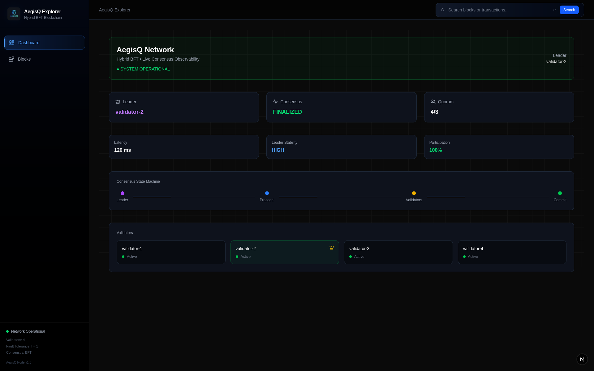
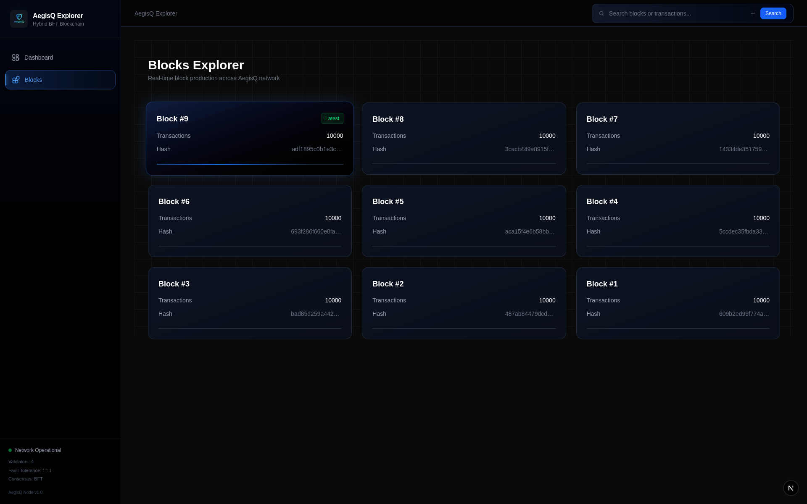
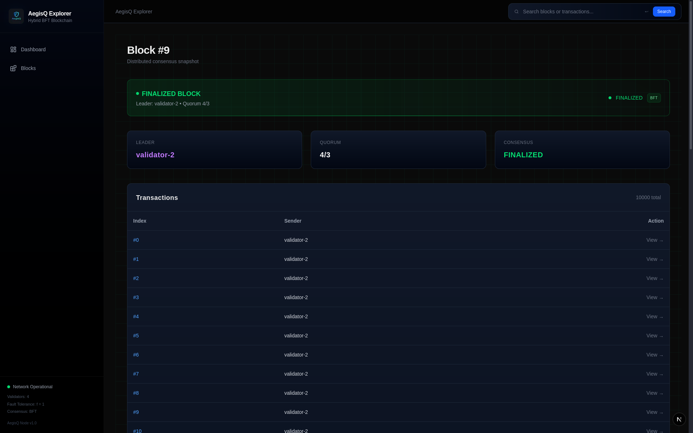
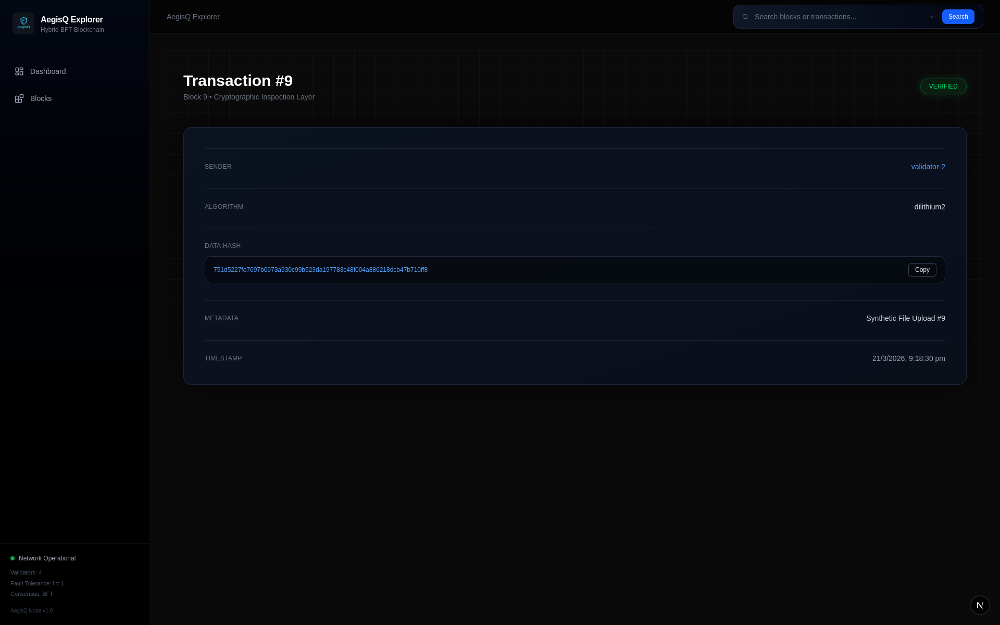
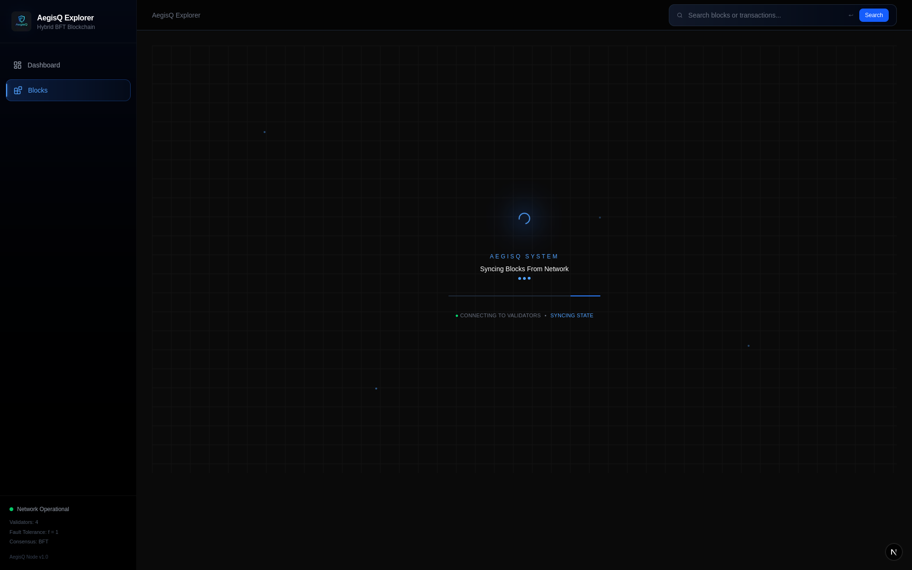

# AegisQ Protocol

<p align="center">
<b>Deterministic Consensus Engine • Full-Stack Observability • Post-Quantum Cryptography</b>
</p>

---

## Overview

**AegisQ Protocol** is a full-stack consensus system combining a deterministic BFT-style engine with a real-time observability platform.
# AegisQ Protocol

<p align="center">
<b>Deterministic Consensus Engine • Full-Stack Observability • Post-Quantum Cryptography</b>
</p>

---

## Overview

**AegisQ Protocol** is a full-stack consensus system combining a deterministic BFT-style engine with a real-time observability platform.

It is designed to execute, validate, and expose consensus behavior with complete transparency across blocks, transactions, and validator activity.

This project integrates:

* Consensus engine (core execution layer)
* Backend API system
* Persistent storage
* Web-based observability interface

---

## System Architecture

```
AegisQ Core (Go)
   │
   ├── Consensus Engine (Prepare → Commit → Finalize)
   ├── Transaction Processing Pipeline
   ├── Block Construction & Validation
   ├── Storage Layer (BoltDB)
   │
   └── REST API (Explorer API)
          │
          ▼
   Explorer Backend Layer
          │
          ▼
   Frontend (React + Tailwind)
```

---

## System Layer Breakdown

The system is structured into layered components to separate execution, consensus, storage, and observability responsibilities.

| Layer | Component            | Responsibility                               |
| ----- | -------------------- | -------------------------------------------- |
| 1     | API Layer            | Exposes system state via REST endpoints      |
| 2     | Explorer Backend     | Aggregates and formats data for UI           |
| 3     | Frontend UI          | Visualizes blocks, transactions, and metrics |
| 4     | Consensus Engine     | Handles Prepare → Commit → Finalize logic    |
| 5     | Voting Module        | Manages validator votes and quorum           |
| 6     | Transaction Pipeline | Processes and validates transactions         |
| 7     | Block Builder        | Constructs blocks from transactions          |
| 8     | Cryptographic Layer  | Handles hashing and signature verification   |
| 9     | Storage Layer        | Persists blocks and transactions (BoltDB)    |
| 10    | Execution Engine     | Ensures deterministic state transitions      |

---

## Core Engine (AegisQ Core v1)

### Consensus Execution

* Deterministic consensus pipeline
* Prepare → Commit → Finalize flow
* Quorum-based agreement model (2f + 1)
* Fully reproducible execution

---

### System Components

* Consensus Engine (voting + quorum logic)
* Transaction processing pipeline
* Block construction and validation
* Cryptographic module (Dilithium + SHA3-256)
* Persistent storage using BoltDB
* REST API exposing system state

---

### Performance

* ~8,000 transactions/sec (controlled execution)
* Sub-second finalization latency

---

## Observability Layer (AegisQ Explorer)

A real-time interface to inspect internal system behavior and consensus execution.

---

### Dashboard — System State



Displays:

* Leader node
* Consensus status
* Quorum state
* System metrics

---

### Block Explorer



Browse blocks with:

* Block height
* Transaction count
* Block hash

---

### Block Details



Inspect:

* Finalization state
* Transaction inclusion
* Block metadata

---

### Transaction Explorer



Detailed transaction view including:

* Sender
* Signature algorithm (Dilithium)
* Data hash
* Metadata

---

### System Sync / Execution State



Represents execution progression and system state.

---

## Key Capabilities

* Deterministic consensus execution
* Quorum-based finality
* Full system observability
* Block and transaction-level inspection
* Validator participation tracking
* Cryptographic verification visibility
* Integrated full-stack architecture

---

## Tech Stack

### Backend

* Go
* REST API

### Storage

* BoltDB

### Frontend

* React
* TailwindCSS
* Recharts

---

## Use Cases

* Consensus system analysis
* Blockchain observability
* Transaction verification
* Validator activity inspection
* System debugging and monitoring

---

## Run Locally

### Start Core

```bash
go run ./cmd/aegisqd
```

### Start Explorer

```bash
npm install
npm run dev
```

Open:
[http://localhost:3000](http://localhost:3000)

---

## Project Structure

```
core/
consensus/
crypto/
ledger/
storage/
simulation/

cmd/
aegisqd/

explorer/
web-ui/
```

---

## Positioning

AegisQ Protocol is a full-stack consensus system with integrated observability, designed to demonstrate how systems execute, validate, and finalize state with transparency.

---

<p align="center">
<b>Build systems. Observe them. Understand them.</b>
</p>

It is designed to execute, validate, and expose consensus behavior with complete transparency across blocks, transactions, and validator activity.

This project integrates:

* Consensus engine (core execution layer)
* Backend API system
* Persistent storage
* Web-based observability interface

---

## System Architecture

```
AegisQ Core (Go)
   │
   ├── Consensus Engine (Prepare → Commit → Finalize)
   ├── Transaction Processing Pipeline
   ├── Block Construction & Validation
   ├── Storage Layer (BoltDB)
   │
   └── REST API (Explorer API)
          │
          ▼
   Explorer Backend Layer
          │
          ▼
   Frontend (React + Tailwind)
```

---

## System Layer Breakdown

The system is structured into layered components to separate execution, consensus, storage, and observability responsibilities.

| Layer | Component            | Responsibility                               |
| ----- | -------------------- | -------------------------------------------- |
| 1     | API Layer            | Exposes system state via REST endpoints      |
| 2     | Explorer Backend     | Aggregates and formats data for UI           |
| 3     | Frontend UI          | Visualizes blocks, transactions, and metrics |
| 4     | Consensus Engine     | Handles Prepare → Commit → Finalize logic    |
| 5     | Voting Module        | Manages validator votes and quorum           |
| 6     | Transaction Pipeline | Processes and validates transactions         |
| 7     | Block Builder        | Constructs blocks from transactions          |
| 8     | Cryptographic Layer  | Handles hashing and signature verification   |
| 9     | Storage Layer        | Persists blocks and transactions (BoltDB)    |
| 10    | Execution Engine     | Ensures deterministic state transitions      |

---

## Core Engine (AegisQ Core v1)

### Consensus Execution

* Deterministic consensus pipeline
* Prepare → Commit → Finalize flow
* Quorum-based agreement model (2f + 1)
* Fully reproducible execution

---

### System Components

* Consensus Engine (voting + quorum logic)
* Transaction processing pipeline
* Block construction and validation
* Cryptographic module (Dilithium + SHA3-256)
* Persistent storage using BoltDB
* REST API exposing system state

---

### Performance

* ~8,000 transactions/sec (controlled execution)
* Sub-second finalization latency

---

## Observability Layer (AegisQ Explorer)

A real-time interface to inspect internal system behavior and consensus execution.

---

### Dashboard — System State


Displays:

* Leader node
* Consensus status
* Quorum state
* System metrics

---

### Block Explorer


Browse blocks with:

* Block height
* Transaction count
* Block hash

---

### Block Details


Inspect:

* Finalization state
* Transaction inclusion
* Block metadata

---

### Transaction Explorer


Detailed transaction view including:

* Sender
* Signature algorithm (Dilithium)
* Data hash
* Metadata

---

### System Sync / Execution State


Represents execution progression and system state.

---

## Key Capabilities

* Deterministic consensus execution
* Quorum-based finality
* Full system observability
* Block and transaction-level inspection
* Validator participation tracking
* Cryptographic verification visibility
* Integrated full-stack architecture

---

## Cryptographic Performance Benchmarks

Benchmarked Dilithium (post-quantum) against ECDSA to evaluate performance and memory trade-offs.

| Operation      | Dilithium | ECDSA  |
| -------------- | --------- | ------ |
| Key Generation | ~13 µs    | ~12 µs |
| Signing        | ~44 µs    | ~39 µs |
| Verification   | ~13 µs    | ~61 µs |

### Observations

* Dilithium verification is significantly faster than ECDSA
* ECDSA incurs higher memory allocations during signing
* Post-quantum signatures show competitive performance under controlled execution

These benchmarks highlight trade-offs between classical and post-quantum cryptographic primitives in consensus systems.

---

## Tech Stack

### Backend

* Go
* REST API

### Storage

* BoltDB

### Frontend

* React
* TailwindCSS
* Recharts

---

## Use Cases

* Consensus system analysis
* Blockchain observability
* Transaction verification
* Validator activity inspection
* System debugging and monitoring

---

## Run Locally

### Start Core

```bash
go run ./cmd/aegisqd
```

### Start Explorer

```bash
npm install
npm run dev
```

Open:
[http://localhost:3000](http://localhost:3000)

---

## Project Structure

```
core/
consensus/
crypto/
ledger/
storage/
simulation/

cmd/
aegisqd/

explorer/
web-ui/
```

---

## Positioning

AegisQ Protocol is a full-stack consensus system with integrated observability, designed to demonstrate how systems execute, validate, and finalize state with transparency.

---

<p align="center">
<b>Build systems. Observe them. Understand them.</b>
</p>
