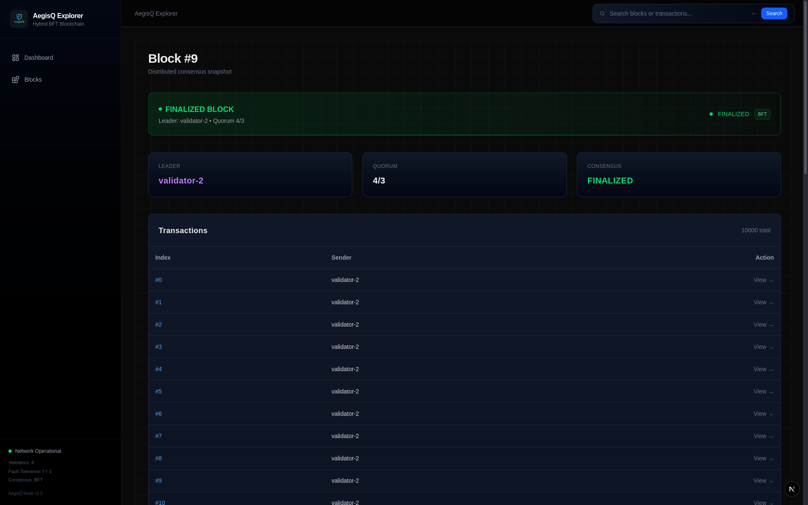

# AegisQ Protocol

## Deterministic Consensus Engine with Full-Stack Observability

AegisQ Protocol is a full-stack consensus system combining a deterministic BFT-style engine with a real-time observability platform.

It is designed to execute, validate, and expose consensus behavior with transparency across blocks, transactions, and validator activity.

## Overview

AegisQ integrates a consensus engine, backend API, persistent storage, and a web-based observability interface into a single system.

The goal is to provide both execution and visibility — enabling users to understand how consensus is reached and how state evolves over time.

## Architecture

```
AegisQ Core (Go)
   │
   ├── Consensus Engine (Prepare → Commit → Finalize)
   ├── Transaction Processing Pipeline
   ├── Block Construction & Validation
   ├── Storage Layer (BoltDB)
   │
   └── REST API
          │
          ▼
   Explorer Backend
          │
          ▼
   Frontend (React + Tailwind)
```

## System Layers

| Layer | Component            | Responsibility                          |
| ----- | -------------------- | --------------------------------------- |
| 1     | API Layer            | Exposes system state via REST endpoints |
| 2     | Explorer Backend     | Aggregates data for UI                  |
| 3     | Frontend UI          | Visualizes blocks and metrics           |
| 4     | Consensus Engine     | Handles Prepare → Commit → Finalize     |
| 5     | Voting Module        | Manages validator quorum                |
| 6     | Transaction Pipeline | Processes and validates transactions    |
| 7     | Block Builder        | Constructs blocks                       |
| 8     | Cryptographic Layer  | Hashing and signature verification      |
| 9     | Storage Layer        | Persists blocks (BoltDB)                |
| 10    | Execution Engine     | Ensures deterministic state transitions |

## Core Engine

### Consensus

* Deterministic execution pipeline
* Prepare → Commit → Finalize flow
* Quorum-based agreement (2f + 1)
* Reproducible state transitions

### Components

* Consensus engine (voting + quorum)
* Transaction processing pipeline
* Block construction and validation
* Cryptographic module (Dilithium + SHA3-256)
* Persistent storage (BoltDB)
* REST API

### Performance

* ~8,000 transactions/sec
* Sub-second finalization latency

## Capabilities

* Deterministic consensus execution
* Quorum-based finality
* Full system observability
* Transaction and block inspection
* Validator participation tracking
* Cryptographic verification visibility

## Post-Quantum Cryptography (Dilithium)

AegisQ integrates **Dilithium**, a post-quantum digital signature scheme, as a core component of its cryptographic layer.

### Why Dilithium

* Resistant to quantum attacks (lattice-based cryptography)
* Standardized candidate for post-quantum security
* Suitable for high-assurance distributed systems

### Integration in AegisQ

* Used for transaction signing and verification
* Ensures future-proof security against quantum adversaries
* Combined with SHA3-256 for hashing integrity

### Impact

* Strong security guarantees for validator signatures
* Enables exploration of post-quantum consensus systems
* Demonstrates real-world feasibility of PQC in distributed execution

## Cryptographic Benchmarks

| Operation      | Dilithium | ECDSA  |
| -------------- | --------- | ------ |
| Key Generation | ~13 µs    | ~12 µs |
| Signing        | ~44 µs    | ~39 µs |
| Verification   | ~13 µs    | ~61 µs |

### Observations

* Dilithium verification is faster than ECDSA
* ECDSA incurs higher cost during verification
* Post-quantum signatures show competitive performance

## Tech Stack

### Backend

Go, REST API

### Storage

BoltDB

### Frontend

React, Tailwind CSS, Recharts

## Use Cases

* Consensus system analysis
* Blockchain observability
* Transaction verification
* Validator monitoring
* System debugging

## Running Locally

### Core

```bash
go run ./cmd/aegisqd
```

### Explorer

```bash
npm install
npm run dev
```

Open: [http://localhost:3000](http://localhost:3000)

## Project Structure

```
core/
consensus/
crypto/
ledger/
storage/
simulation/

cmd/
aegisqd/

explorer/
web-ui/
```

## SOC Relevance

AegisQ Protocol demonstrates core concepts aligned with Security Operations and system integrity analysis:

* System integrity monitoring across blocks, transactions, and state transitions
* Behavioral analysis of consensus execution (Prepare → Commit → Finalize)
* Cryptographic verification using post-quantum signatures (Dilithium) and SHA3-256
* Full observability of validator activity, quorum state, and execution flow
* Detection surface for anomalies such as inconsistent state, invalid signatures, and abnormal execution patterns

This positions the system as a platform for understanding how secure distributed systems maintain trust, detect inconsistencies, and expose internal behavior for investigation.

## Observability Interface

### Dashboard


Displays system status, leader node, and quorum state.

### Block Explorer


Browse block height, transactions, and hashes.

### Block Details



Inspect finalization state and metadata.

### Transaction View


View sender, signatures, and transaction data.

### Execution State


Monitor system synchronization and execution progress.

## Security Research & Documentation

This project is supported by **100+ documented attack scenarios, system behaviors, and analysis notes** covering:

* Consensus-level attack vectors
* Validator manipulation scenarios
* Transaction integrity violations
* Cryptographic verification edge cases
* System state inconsistencies and failure modes

These documents provide deeper insight into how distributed systems behave under adversarial conditions and how such behaviors can be analyzed and detected.

## Positioning

AegisQ Protocol is a full-stack consensus system with integrated observability, designed to demonstrate how distributed systems execute, validate, and maintain integrity under both normal and adversarial conditions.

## Whitepaper

Full technical whitepaper:

[https://sai-shashank-2005.github.io/aegisq-consensus-whitepaper/](https://sai-shashank-2005.github.io/aegisq-consensus-whitepaper/)

This document provides a detailed analysis of the protocol, including system model, consensus design, adversarial testing, and failure analysis.

## Security Analysis Highlights

The system was evaluated under multiple adversarial scenarios to understand real-world failure modes and attack surfaces.

Key findings:

* Replay attacks possible due to absence of nonce (data-layer vulnerability)
* Transaction ordering can cause consensus divergence without any attacker
* JSON-based hashing introduces non-determinism across environments
* Lack of view-change mechanism leads to complete liveness failure
* Cross-view voting without locking can break safety in distributed settings
* Predictable leader selection enables targeted attacks

Security insight:

> Correctness in deterministic environments does not imply security in distributed adversarial systems

These findings demonstrate a strong understanding of failure analysis, attack modeling, and protocol-level security reasoning.

## Author

Sai Shashank P |
Cybersecurity Engineer
