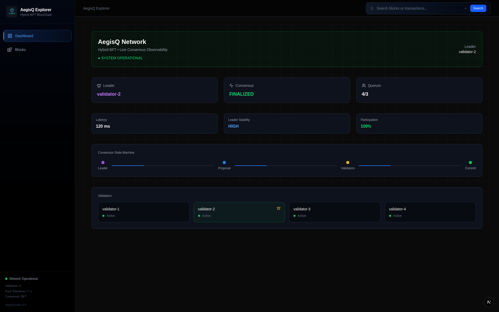
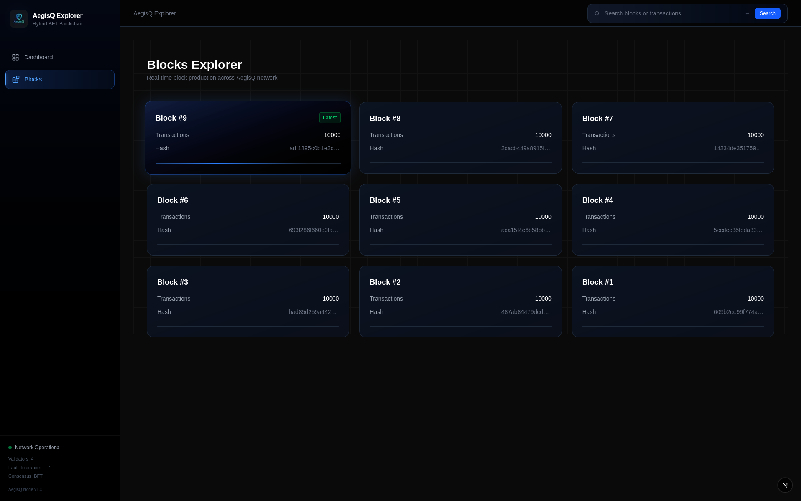
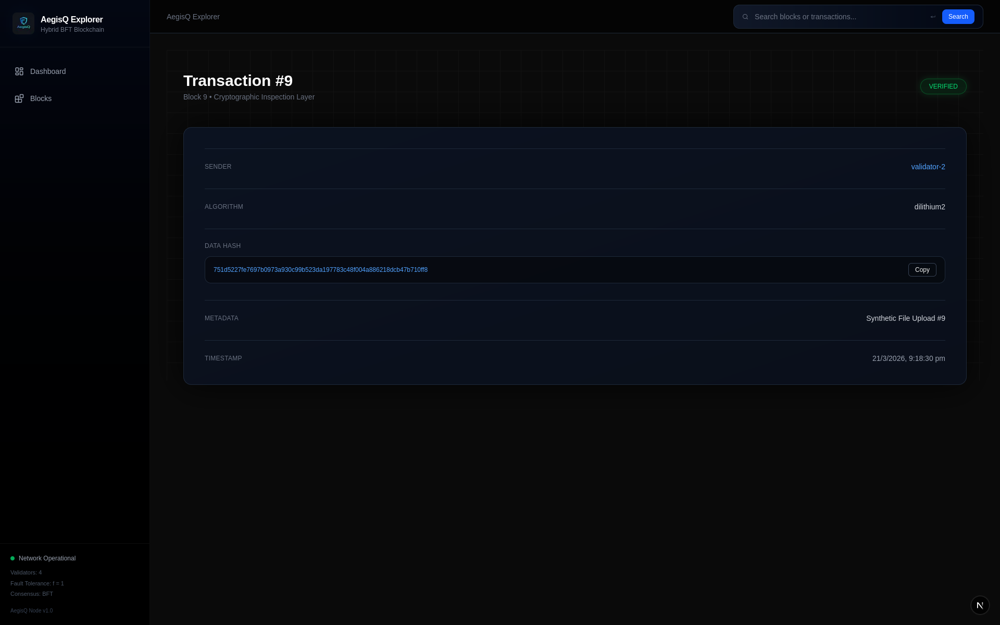
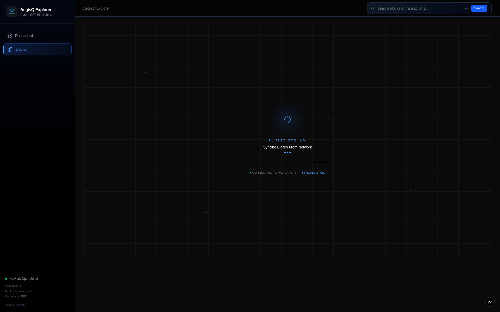

# 🛡️ AegisQ Protocol: Post-Quantum BFT Consensus Engine

[]()
[-orange.svg)]()
[-purple.svg)]()
[]()
[]()

> **Deterministic Consensus Engine with Full-Stack Observability**
> AegisQ Protocol is a full-stack distributed consensus system combining a highly deterministic BFT-style engine with a real-time observability platform. It is designed to execute, validate, and expose consensus behavior with total transparency—enabling security researchers to monitor how state evolves, how quorum is reached, and how the network responds to adversarial conditions.

---

## 🎯 Security & SOC Relevance

AegisQ Protocol demonstrates core concepts aligned with **Security Operations, Threat Modeling, and System Integrity Analysis**:

* **State Integrity Monitoring:** Tracks consensus execution across the `Prepare → Commit → Finalize` lifecycle.
* **Post-Quantum Cryptography (PQC):** Replaces legacy algorithms with **Dilithium (ML-DSA-44)** to ensure future-proof signature verification against quantum adversaries.
* **Adversarial Resiliency:** The engine strictly enforces equivocation tracking, fork prevention, and double-vote rejection.
* **Full Observability:** The dedicated frontend explorer provides a detection surface for anomalies such as invalid signatures, stalled quorums, and abnormal execution patterns.

> *Security Insight: "Correctness in deterministic environments does not imply security in distributed adversarial systems."*

---

## 🏗️ Core Architecture & System Layers

AegisQ integrates the consensus engine, backend REST API, BoltDB persistent storage, and a React-based observability interface into a unified system.

<table width="100%">
  <tr>
    <th width="30%">Layer</th>
    <th width="70%">Responsibility</th>
  </tr>
  <tr>
    <td><strong>Consensus Engine</strong></td>
    <td>Handles the deterministic <code>Prepare → Commit → Finalize</code> BFT voting flow.</td>
  </tr>
  <tr>
    <td><strong>Voting Module</strong></td>
    <td>Manages the <code>2f + 1</code> validator quorum and strict equivocation prevention.</td>
  </tr>
  <tr>
    <td><strong>Cryptographic Layer</strong></td>
    <td>Integrates Dilithium PQC and ECDSA for signing, and SHA3-256 for state hashing.</td>
  </tr>
  <tr>
    <td><strong>Execution & Block Builder</strong></td>
    <td>Ensures deterministic state transitions, Merkle root computation, and block linking.</td>
  </tr>
  <tr>
    <td><strong>API & Storage Layer</strong></td>
    <td>Persists finalized blocks in BoltDB and exposes system state via REST endpoints.</td>
  </tr>
  <tr>
    <td><strong>Explorer Frontend</strong></td>
    <td>Visualizes real-time block production, leader stability, and network liveness.</td>
  </tr>
</table>

---

## 🔬 Adversarial Simulation & Threat Modeling

The protocol includes a dedicated simulation module (`core/simulation/`) designed to evaluate the network against 100+ documented attack scenarios.

<table width="100%">
  <tr>
    <th width="30%">Simulated Attack Vector</th>
    <th width="70%">Engine Mitigation & Observation</th>
  </tr>
  <tr>
    <td><strong>Byzantine Equivocation</strong></td>
    <td>A malicious validator attempts to vote for two conflicting blocks in the same view. The <code>VotePool</code> rejects the double-vote to prevent illegal quorums.</td>
  </tr>
  <tr>
    <td><strong>Fork Exploitation</strong></td>
    <td>Simulates a network split where honest nodes vote differently. The Finality Engine strictly enforces a single finalization per height.</td>
  </tr>
  <tr>
    <td><strong>Signature Corruption</strong></td>
    <td>Attempts to mutate transaction payloads post-signing. Detected and rejected by the Cryptographic verification layer.</td>
  </tr>
  <tr>
    <td><strong>Leader Manipulation</strong></td>
    <td>Evaluates predictable round-robin scheduling against targeted DDoS or manipulation.</td>
  </tr>
</table>

---

## ⚡ Performance & PQC Benchmarks

Despite utilizing heavy Post-Quantum Cryptography, AegisQ maintains high throughput (~8,000 TPS) and sub-second finalization latency.

<table width="100%">
  <tr>
    <th width="30%">Cryptographic Operation</th>
    <th width="35%">Dilithium (Post-Quantum)</th>
    <th width="35%">ECDSA (P-256)</th>
  </tr>
  <tr>
    <td><strong>Key Generation</strong></td>
    <td>~13 µs</td>
    <td>~12 µs</td>
  </tr>
  <tr>
    <td><strong>Signing</strong></td>
    <td>~44 µs</td>
    <td>~39 µs</td>
  </tr>
  <tr>
    <td><strong>Verification</strong></td>
    <td><strong>~13 µs</strong> (Highly Optimized)</td>
    <td>~61 µs</td>
  </tr>
</table>

---

## 🖥️ Observability Interface (Explorer)

*The frontend provides real-time telemetry on the consensus state machine.*

| Feature | Description | Screenshot Placeholder |
| :--- | :--- | :--- |
| **Network Dashboard** | Displays system status, current leader, and real-time quorum state. |  |
| **Block Explorer** | Browse finalized heights, Merkle roots, and aggregate block hashes. |  |
| **Cryptographic Inspection** | Deep-dive into transaction metadata, sender identity, and Dilithium signatures. |  |
| **Liveness Monitor** | Tracks synchronization, execution progress, and identifies network stalls. |  |

---

## 📄 Technical Whitepaper

For a deep dive into the protocol's formal specifications, system models, and failure analysis, please refer to the official AegisQ whitepaper:

**🔗 [Read the Full AegisQ Consensus Whitepaper](https://sai-shashank-2005.github.io/aegisq-consensus-whitepaper/)**

*This document provides a detailed breakdown of the protocol, including consensus design, adversarial testing methodologies, and architectural decisions.*

---

## 🛠️ Technology Stack

<table width="100%">
  <tr>
    <th width="30%">Category</th>
    <th width="70%">Technologies Used</th>
  </tr>
  <tr>
    <td><strong>Core Node / Backend</strong></td>
    <td><code>Go (Golang)</code>, <code>REST API</code>, <code>bbolt (BoltDB)</code></td>
  </tr>
  <tr>
    <td><strong>Frontend Explorer</strong></td>
    <td><code>Next.js 15</code>, <code>React 19</code>, <code>Tailwind CSS v4</code>, <code>Lucide React</code></td>
  </tr>
  <tr>
    <td><strong>Cryptography</strong></td>
    <td><code>liboqs (C wrapper)</code>, <code>Dilithium</code>, <code>ECDSA</code>, <code>Ed25519</code>, <code>SHA3-256</code></td>
  </tr>
</table>

---

## 🚀 Setup & Installation

### 1. Start the Core Consensus Node
```bash
# Run the backend engine and consensus pipeline
go run ./cmd/aegisqd
```
*(The REST API will initialize on `http://localhost:8080`)*

### 2. Start the Explorer UI
```bash
cd aegisq-explorer
npm install
npm run dev
```
*(The Explorer will be available at `http://localhost:3000`)*

---

## ⚖️ License & Author

**Sai Shashank P**
*Cybersecurity Engineer | Protocol Researcher*

*Distributed under the [Apache License, Version 2.0](LICENSE).*
